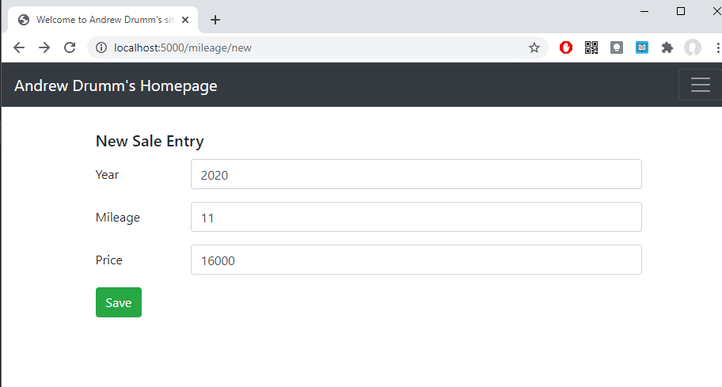
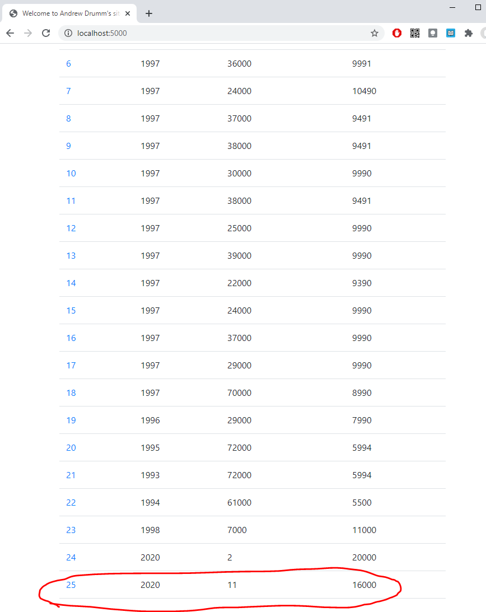
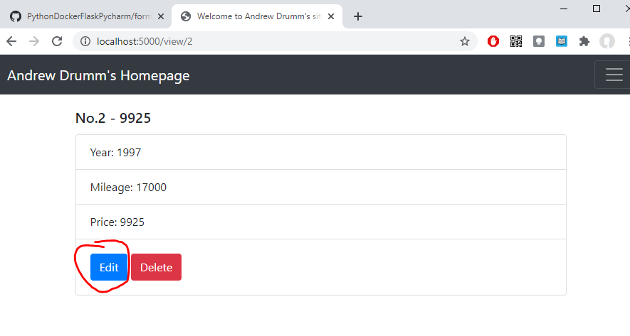
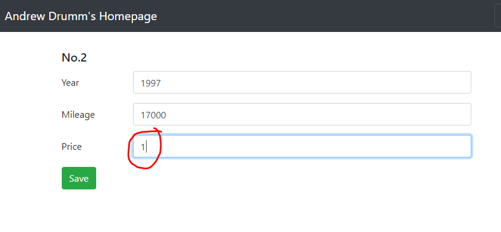
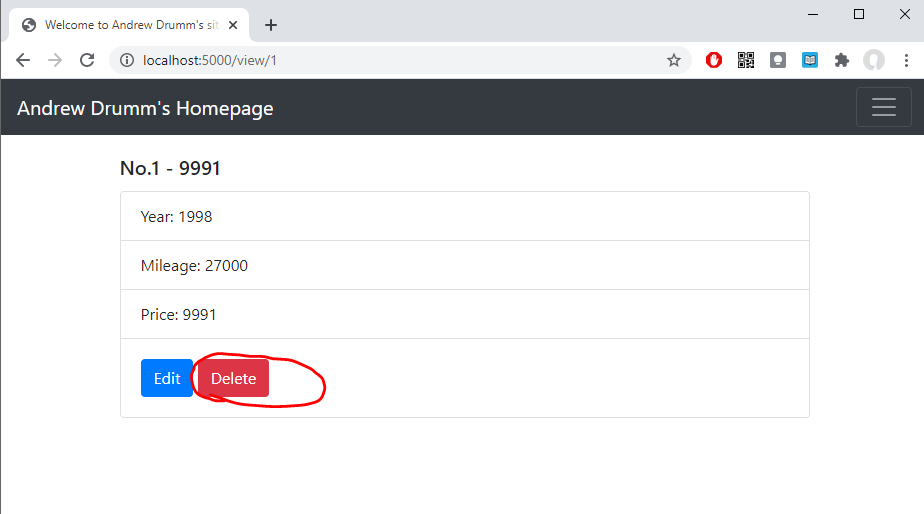
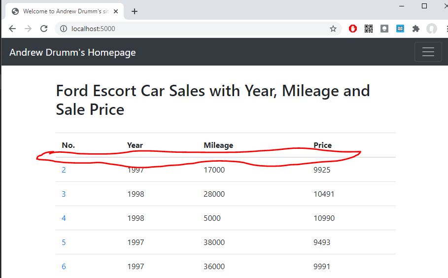

<h1>Homework 3</h1>

This is a homework assignment demonstrating a data table being viewed in a web browser, showing just one record, adding a new record and deleteing a record. 

2a. My Data Table viewed in Pycharm

2b. Homepage displaying my data.

2c. Single record view.

2d. New Record Added to Homepage

2e. Updated record.

2f. Deleted Record.

