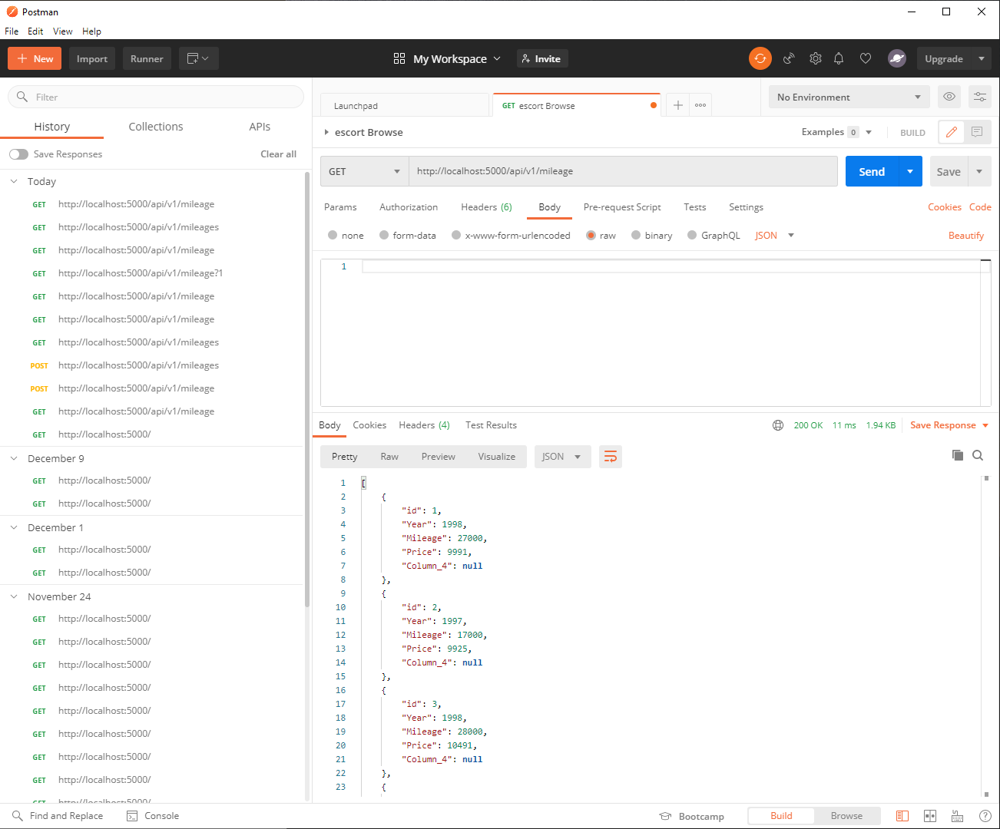
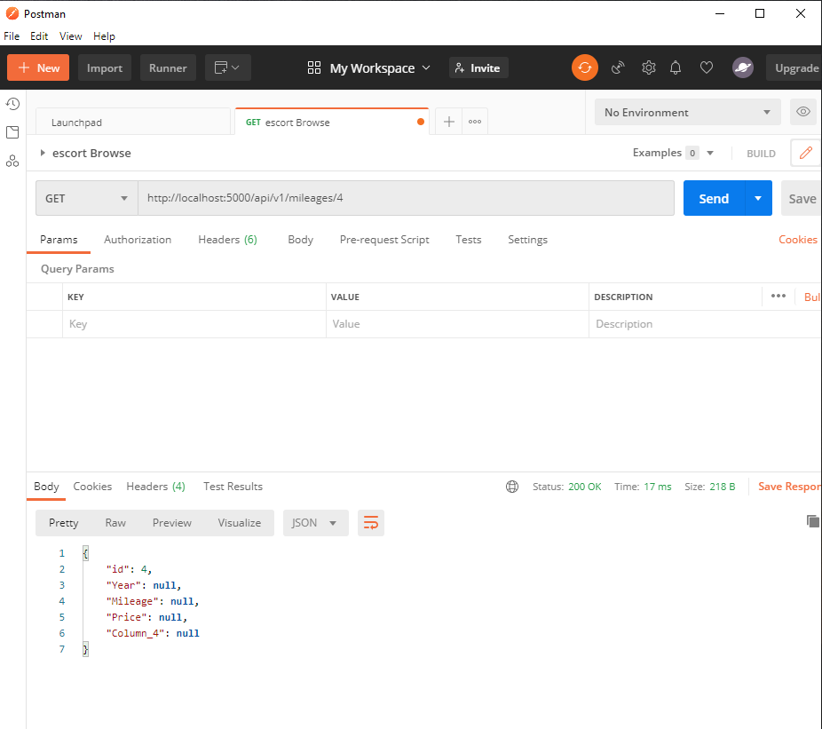
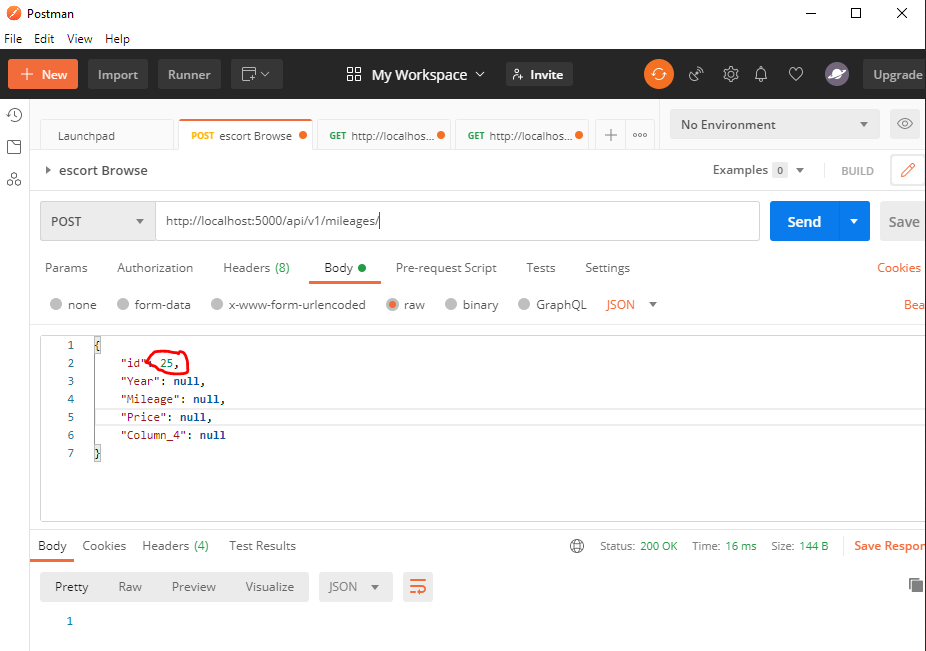
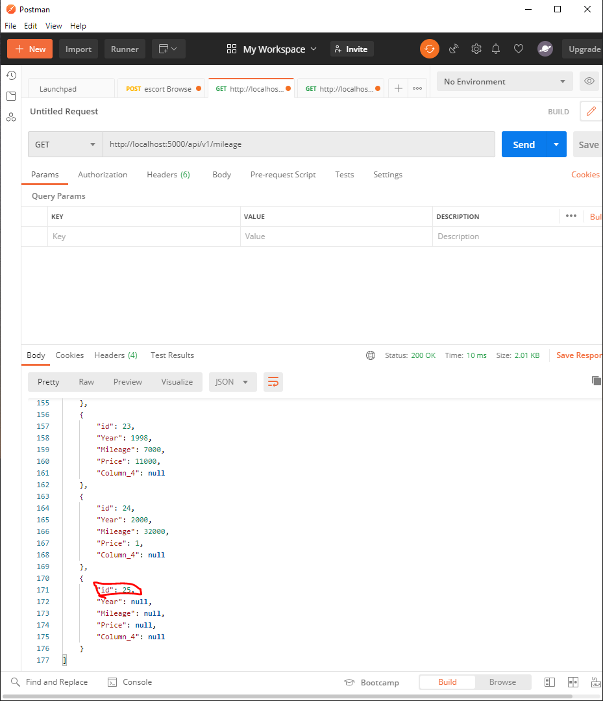
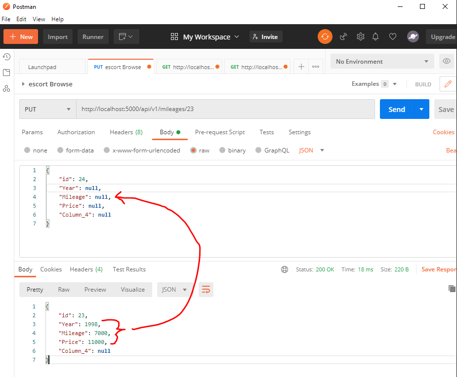
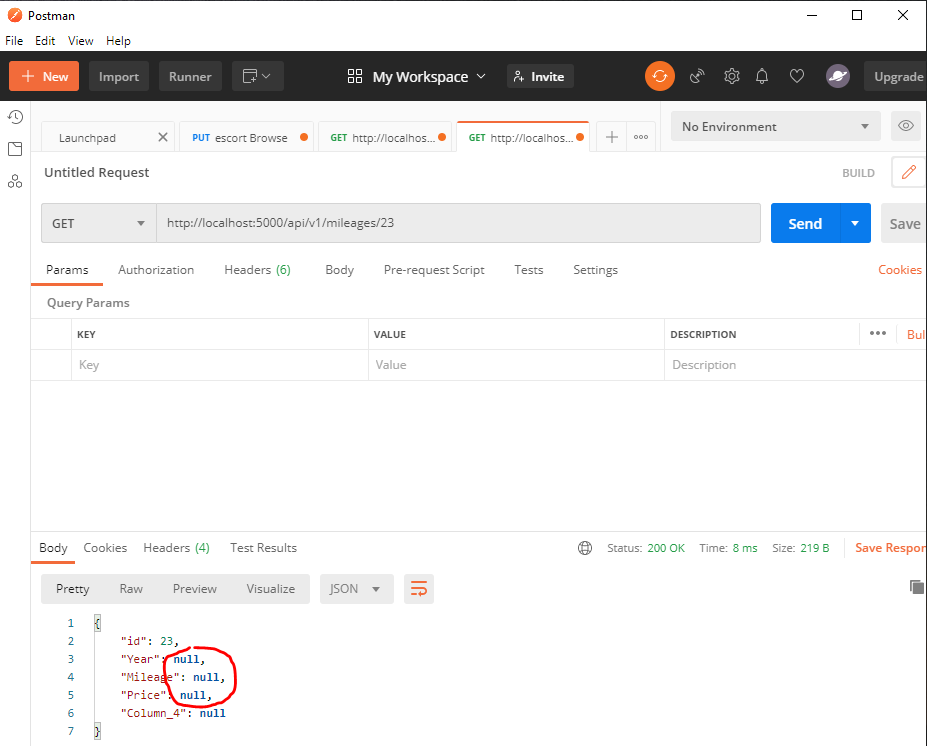
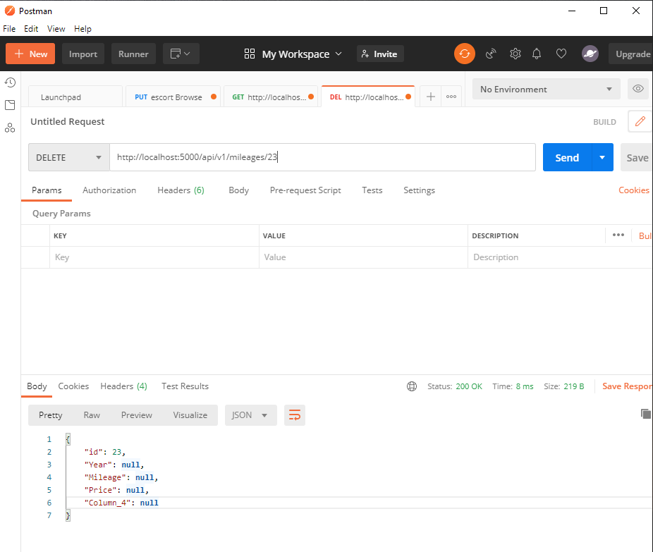
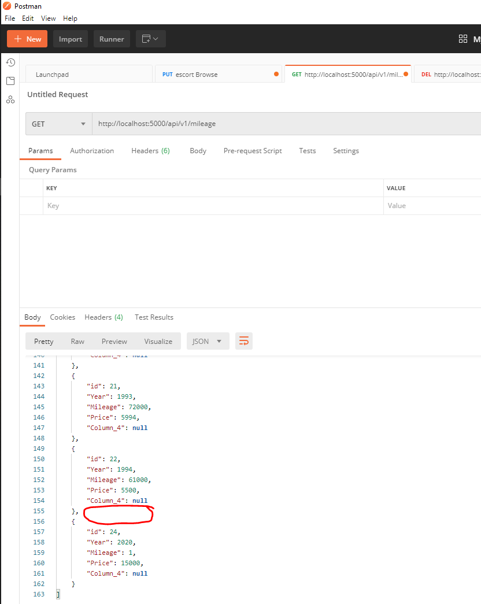

<h1>Homework 4</h1>

This is a homework assignment demonstrating Postman

2a. Postman listing all records

2b. Showing 1 record with get request

2c. Creating a record by showing the post request and the results in the record listing.

2d. Editing a record with put request and showing results.

2e. Deleting a record using delete request and showing results. 

